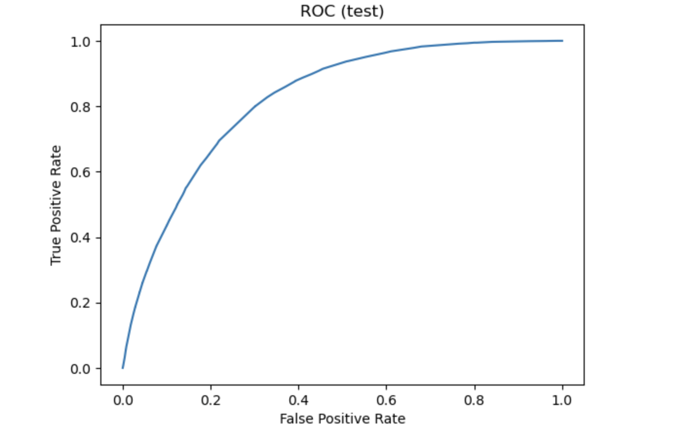

# GlucoGuard — Diabetes Risk (BRFSS)

> **Disclaimer:** This project is for **educational and demonstration** purposes.  
> It is **not** a medical device and must not be used for diagnosis or treatment.

---

## 🚩 Problem

Diabetes impacts hundreds of millions worldwide. Traditional screening relies on clinic visits and lab tests—barriers that delay evaluation, especially in outreach and low-resource settings.  
Teams need a **fast, explainable, and accessible** way to approximate risk from self-reported information.

---

## 💡 Solution

**GlucoGuard** is a lightweight web app that turns survey-style inputs (inspired by CDC BRFSS health indicators) into a **calibrated probability** and a clear **At Risk / Not at Risk** classification.  
A **threshold slider** lets you tune sensitivity vs. specificity to match your scenario (awareness campaigns vs. precision follow-ups).

**What you get**
- 🧮 Calibrated risk probabilities
- 🎚️ Adjustable decision threshold (operating point control)
- ⚡ Instant result from a simple form (no file uploads)
- 📦 Reusable model artifact (`model_diabetes_brfss.pkl`)
- 🧪 Reproducible training workflow in the included notebook

---

## 🎯 Impact

- **Awareness & education**: communicate how lifestyle and self-reported health relate to risk  
- **Early triage**: quickly identify who might benefit from formal testing  
- **Transparency**: probability + threshold-based classification for non-technical audiences

*Again, this is not a diagnostic tool.*

---

## 🔎 Signals considered (high level)

Self-reported health indicators commonly captured in BRFSS-style surveys, including:
- Basic demographics (e.g., age group, sex)  
- Lifestyle indicators (e.g., physical activity)  
- Health status flags (e.g., blood pressure / cholesterol)  
- Body composition (e.g., BMI)  
- General self-rated health

Inputs are numeric/categorical with friendly controls in the UI.

---

## 🧠 How it works

[User Inputs] → [Feature Vector] → [Scaler + ML Model] → [Probability Calibrator] → Prob.
│
[Threshold]
│
At Risk (1) / Not at Risk (0)

---

- **Modeling:** scikit-learn pipeline with standardization, class-imbalance handling, and probability **calibration**  
- **Selection:** decision threshold chosen on a validation split (F1-oriented) and editable in the UI  
- **Packaging:** model + feature list + operating threshold serialized with `joblib` for reproducibility

> Example test metrics from one training run (will vary):  
> **ROC-AUC ~ 0.82**, **PR-AUC ~ 0.38**, **F1 ~ 0.45** at an operating threshold ≈ 0.23.

---

## 📈 Model evaluation

**Operating point shown below:** threshold ≈ 0.22 (chosen on a validation split).

  

- Counts (from the plot): **TN=26,511**, **FP=6,239**, **FN=1,899**, **TP=3,403**  (N=38,052)  
- Precision ≈ **0.353**, Recall ≈ **0.642**, F1 ≈ **0.455**, Specificity ≈ **0.809**  
- ROC-AUC ≈ **0.821** (example run; will vary with training)

  

  

---

## ✨ Features

- Clean, responsive Streamlit UI with a hero header and results card  
- Single-person risk calculator (no CSV uploads)  
- Threshold tuning for sensitivity/specificity trade-off  
- Version-pinned environment (`requirements.txt`)  
- Training notebook to retrain and export a new artifact

---

## 🗂️ Repository layout

.
├── app.py # Streamlit app
├── model_diabetes_brfss.pkl # Trained, calibrated model bundle (joblib)
├── Diabetes Risk Prediction.ipynb # Training + evaluation notebook
├── requirements.txt # Dependencies
├── Streamlit App - DRP.png # Screenshot for this README
└── .gitignore

---

## 🛠️ Tools used
- **Python**
- **pandas**, **NumPy**
- **scikit-learn** — modeling & probability calibration
- **Streamlit** — UI
- **joblib** — model artifact serialization

---

## ⚖️ Ethics & limitations
- Self-reported survey data can be noisy and biased.
- The model reflects correlations, not causation; performance varies across populations and data quality.
- **Not for clinical use** — always confirm with medical testing and professional evaluation.

---

## 🗺️ Roadmap
- [ ] In-app explanation (feature contributions)
- [ ] Unit tests for the scoring path
- [ ] Lightweight monitoring for drift (if used in batch scoring)
- [ ] Internationalization (labels & hints)

---

## 🙌 Acknowledgments
- CDC **BRFSS** Diabetes Health Indicators (for inspiring the input schema)
- Streamlit & scikit-learn communities

